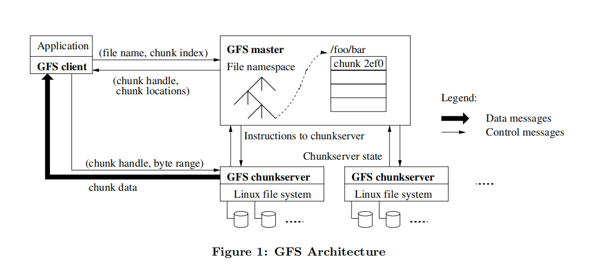
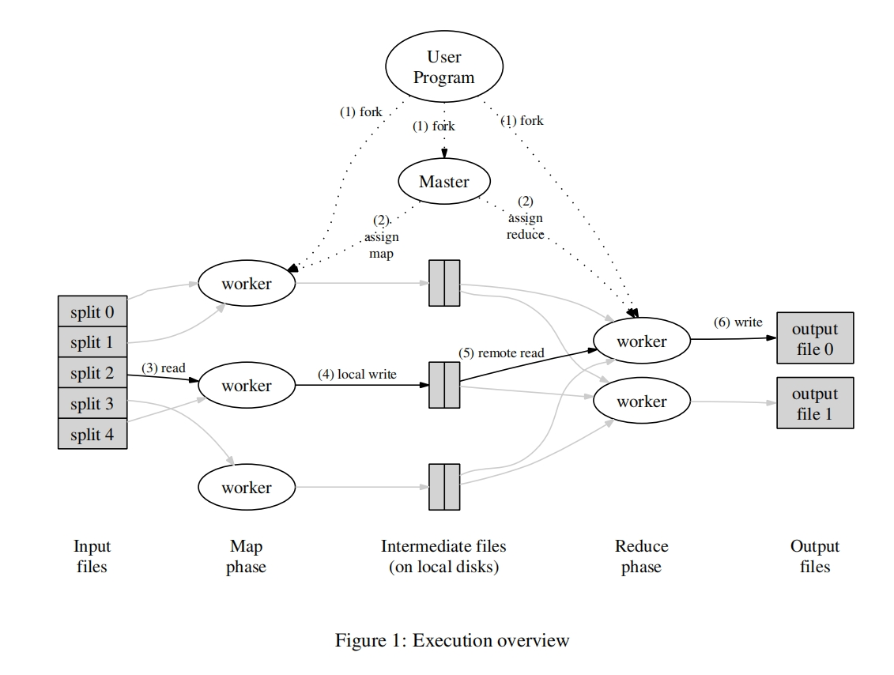
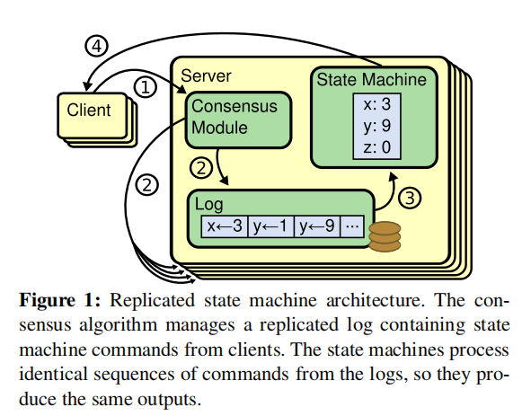
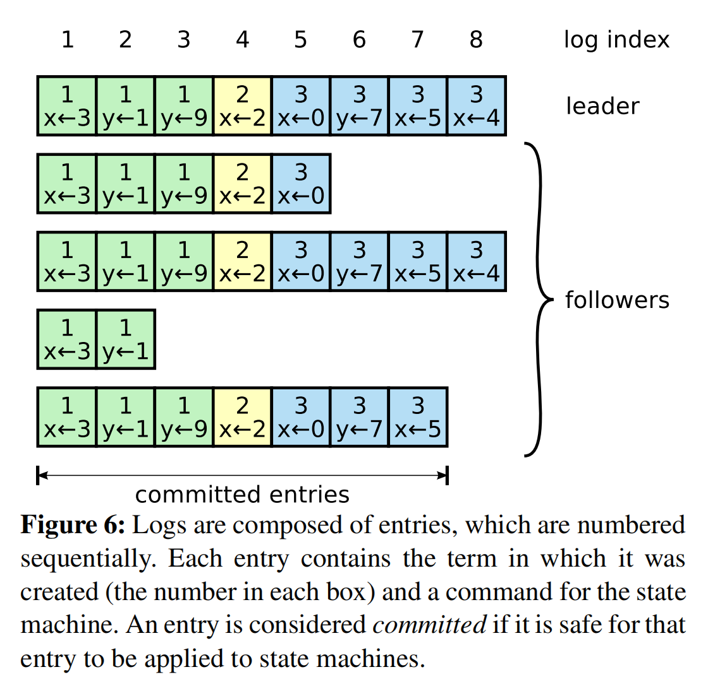
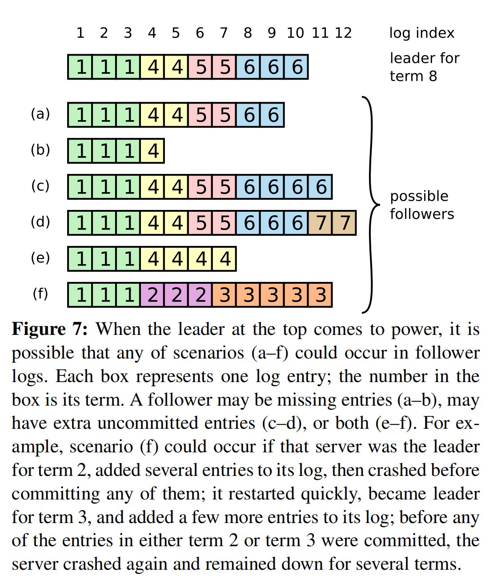

# MIT 6.824 分布式系统

[MIT 6.824](https://pdos.csail.mit.edu/6.824/schedule.html)

参考资料：
- 这里有很多相关的参考资料：[MIT6.824: Distributed System](https://csdiy.wiki/并行与分布式系统/MIT6.824/)
- 一些实现的细节：[OneSizeFitsQuorum/MIT6.824-2021](https://github.com/OneSizeFitsQuorum/MIT6.824-2021/tree/master)
- 纯代码：[PKUFlyingPig/MIT6.824](https://github.com/PKUFlyingPig/MIT6.824/tree/master)
- 课程中文翻译：[MIT6.824](https://mit-public-courses-cn-translatio.gitbook.io/mit6-824)

## Paper
Paper
- [MapReduce 2004](https://pdos.csail.mit.edu/6.824/papers/mapreduce.pdf)
- [GFS 2003](https://pdos.csail.mit.edu/6.824/papers/gfs.pdf)
- [Raft (extended) 2014](https://pdos.csail.mit.edu/6.824/papers/raft-extended.pdf)
- [ZooKeeper 2010](https://pdos.csail.mit.edu/6.824/papers/zookeeper.pdf)

课程没有提到 BigTable，但其实也很重要。

## Lab
Lab
- [Lab 1: MapReduce](https://pdos.csail.mit.edu/6.824/labs/lab-mr.html)
- [Lab 2: Key/Value Server](https://pdos.csail.mit.edu/6.824/labs/lab-kvsrv.html)
- [Lab 3: Raft](https://pdos.csail.mit.edu/6.824/labs/lab-raft.html)
- [Lab 4: Fault-tolerant Key/Value Service](https://pdos.csail.mit.edu/6.824/labs/lab-kvraft.html)
- [Lab 5: Sharded Key/Value Service](https://pdos.csail.mit.edu/6.824/labs/lab-shard.html)

### Lecture 2 - RPC and Threads

为什么用 go？
- 好用的 rpc 框架
- 内存安全，有垃圾回收；多线程。

《Effective Go》

- 线程 Threads vs Goroutes
    - 每个线程有自己的 program counter，stack，register
    - I/O concurrency
    - Multi Parallelism
    - Convenience
- 异步 Asynchronous I/O
    - 也可以叫 event-driven programming 事件驱动编程
    - 底层依赖 epoll 这种 I/O 多路复用

Thread challenges
- n = n + 1，异步带来的数据竞争问题

### GFS

GFS 原理
- GFS 把大文件拆解成多个 64MB 的 file chunk，分散存储到不同的服务器上。
- GFS架构由一个 master 和多个 chunkserver 组成。
- master 存储文件的 chunk 信息，chunkserver 具体存储 chunk 内容。
- client 用户端现请求 master，查询到 chunk 的具体地址，然后去 chunkserver 上拿数据。
- master 如果挂了，由 slave（平常负责只读）转正；
- chunk server 会把一份 chunk 存储 3 个副本（replica），以确保数据高可用性。

### MapReduce
MapReduce 系统能利用大量的技术处理涉及大数据的复杂问题。

系统架构
1. Map 任务，把数据拆分成 key->value 对，也叫中间文件（Intermediate files）存储到硬盘中。
2. Reduce 任务，读取中间文件，汇总

### BigTable

类似 GFS，但是用来存储结构化数据（类似 MongoDB 存储 json？）

按照列来存储数据。但是支持行和列的索引。

BigTable 是 NoSQL，因为行数据不必包含所有的列。

### Raft

#### Raft 概述
Raft 是一种基于投票机制实现的共识算法（Consensus），是 Paxos 算法的改进，主要的改进点是更好理解（Understandability）和实现。

共识算法：是分布式系统中用于在多个独立节点间达成**数据一致性**的核心机制，主要用于解决网络不可靠、节点可能故障等复杂场景下的协同决策问题。

参考资料：https://raft.github.io/

"Raft" 英文原意为木筏，象征该算法为分布式系统提供稳定基础，如同木筏在水面上保持平衡，即使遇到节点故障或网络波动，仍能维持系统一致性。

Replicated State Machines（复制状态机）
- 状态机可以在多个机器上运行，且其中一些机器宕机并不影响整体的系统。
- 通常通过**日志**来实现。日志顺序决定了状态机的最终状态（顺序不能乱）
- （共识算法）负责
    - 选取主节点，接收请求、生成日志；
    - 主节点会把日志同步给所有的子节点；
    - 日志被多数节点确认后，才会真正执行；
- 状态机通过顺序执行日志内容，最终的结果也是一致的。从而保证数据一致性。

Paxos 虽然非常流行，但是：
1. 单决策Paxos（Single-decree Paxos）算法深奥且微妙
2. 只有 Single-decree Paxos 实现方案， multi-Paxos实现细节不确定。导致有很多种的工程实现。

Raft 包含四块内容：
1. Leader election：领导者选举；如果领导者挂了，需要选举出新的领导者；
2. Log Replication：日志复制；领导者从客户端接收日志项（log entry）
3. Safety：安全性；对已经应用的日志项，所有的服务器都需要强制性保持一致。
4. Membership Changes 集群的机器发生变更

**Raft 基础**
一个 Raft 集群包含多个服务器，每个服务器处于三种状态中的一个：
- leader：正常状态下只有一个服务器是 leader；
- candidate：选举新 leader 时的状态；
- follower：被动模式，只能处理请求；

term
- term 在 Raft 系统中可以看做是时间时钟；
- 每个服务器都保存自己的 term 值，两个服务器通信时，小的 term 会被改成大的 term；
- 当一个 leader 或者 candidate 发现自己的 term 值过时了（out of date），

---

Leader 为了维持一致性
- 用 AppendEntries RPCs 检查日志是否有冲突；
- 有冲突，则找到最近的无冲突的那一项，此后的日志项全部删掉。用 Leader 的日志项覆盖。
- 具体如何做呢？
    - Leader 会为每个 server 维持一个 `lastIndex` 变量；初始化为自己的当前 log index
    - 向 server 发动 AppendEntries RPCs
        - 如果失败，说明日志有冲突，则减小 lastIndex
        - 如果成功，说明日志没有冲突，数据会保持一致性；

#### Leader 选举

Follower -> Candidate
- Raft 使用心跳机制（Heartbeat mechanism）来触发 Leader 选举；
- Leader 通过周期性地发送心跳（空的 AppendEntries RPCs），来确保自己的 Leader 地位；
- 如果 Follower 一定时间内没有收到 Leader 的心跳，即到了 `election timeout`，就会认为没有 Leader，接着开始一轮选举；
- 开始选举时，Follower 把自己的 term 自增，并且状态改成 Candidate；

Candidate->Leader
- Candidate 首先给自己投票，然后并发地向其他的服务器发送 RequestVote RPCs，要求给自己投票。
- Candidate 状态的机器只会在下面三种情况下改变状态：1. 自己成为 Leader；2. 另一个服务器成为 Leader；3. 一段时间后，没有胜者
- Candidate 只有在同一个 term 内得到大多数（即大于一半）的投票后才算胜利；这个规则保证了只会有一个 Leader
- Candidate 成为 Leader 后，立马给所有的服务器发送心跳信息，以避免新一轮的选举；

仅当同时满足以下条件时，接收节点投赞成票：
- Candidate的任期号不小于自身当前任期。
- 接收节点未在该任期内投票，或已投票但对象是同一Candidate。
- Candidate的日志至少与自身日志一样新。

Candidate->Follower
- 在等待投票时，Candidate 可能会收到心跳信息；
  - 如果对方的 term 相等或者比自己大，则认可对方的 Leader 地位；
  - 如果对方的 term 比自己小，则拒绝，且继续保持 Candidate 状态；
- 投票的结果可能没有任何人超过半数，则此轮选举结果；candidate 的 term 会自动自动，并开始新一轮的选举；
- 如果没有别的机制，选举可能会无限制的持续下去。
- 解决方法是 `election timeout` 会从一个区间内随机选取（如 150~300ms），这样 follower 会在不同的时间开始选举。减少选举失败的概率。

#### Log replication

Log replication
- 当 Leader 收到客户端的请求（即一条改变状态机的指令），首先把这条命令（Command）作为日志项（Log Entry）增加到自己的日志中。
- 并发地发送 AppendEntries RPCs 到每个服务器，要求复制 Entry。
- 当 Entry 被安全的复制后（具体怎么样才叫安全后面再细说），Leader 会把该 Entry 应用到自己的状态机。并返回结果给客户端。
- Leader 会持续发送 AppendEntries PRCs 给服务器，直到回复。如果服务器宕机、网络丢包、运行慢，PRCs 会持续发。

Log Entry
- 日志是由一个个的 Entry 组成；每个 Entry 有下面几项组成：
  1. Log Index，日志序号，顺序增加；
  2. Command，客户端发来的命令，可以应用于状态机，改变状态值；
  3. Term，当时的 Leader Term 值；
- Commmitted Entries 已提交的日志项，意思是这些Entry可以安全地应用到状态机中了。
- 只有当大于半数的 server 已经复制该Entry，该Entry才会被认为是 Commited
- 日志匹配的性质（Log Matching Property）
  - 如果两个日志的 index 和 term 值一样，那么存储的命令也一样。
    - 这个性质由 Leader 创建 Entry 时指定。
  - 如果两个日志的 index 和 term 值一样，那么之前所有的日志项也是一样的。
    - 这个由 AppendEntries RPCs 去检查，每次都带上前一个日志项，贪心地校验即可。

日志不一致怎么办？
- Leader 的日志和 Server 的日志可能不同，Figure 7 描述了一些常见的情况。
  - a-b 少了一些日志项；c-d,e-f 可能有未提交的日志项；e-f 跟 Leader 有冲突。

#### Safety 安全性

在日志复制时，要求 Leader 完全覆盖 Server 的日志项，但是前提得是 Leader 的日志项是完整的，合理的。

这个性质叫 `the Leader Completeness Property`。

Raft 在选举 Leader 时，就需要 Candidate 的日志项是包含所有的 commited logs，具体做法：
1. Follower 在成为 Candidate 之前，需要发送 `RequestVote RPCs`，同时会带上自己所有的日志项。
2. 如果有服务器的日志更新，则会拒绝投票。
3. 因此只有半数的服务器统一投票，该节点才会成为 Leader，也就保证了日志是得到了半数以上的服务器认可，即处于 commited 状态；

**Committing entries from previous terms**
如果日志项写入了半数的服务器，但是 Leader 突然挂了，后续的 Leader 不一定能保证该日志项的提交。
- Raft 规定只会提交 Leader 当前 term 的日志。

**Leader Completeness Property**
- 论文给出了证明

Follower 和 Candidate 宕机
- Raft 的 RPCs 都是幂等的（idempotent），即多次请求都是一样的结果。

领导者选举（Leader election）是时间敏感性最强的环节。为确保系统能够成功选举并维持一个稳定的领导者，Raft要求满足以下时间约束关系：

`broadcastTime << electionTimeout << MTBF​`

其中：
• ​**broadcastTime**：服务器向集群中所有节点并行发送RPC并接收响应的平均耗时；0.5ms~20ms
• ​**electionTimeout**：选举超时时间（如第5.2节所述）；10ms~500ms
• ​**MTBF**​（Mean Time Between Failures）：单个服务器发生故障的平均间隔时间；≈ several months

三个时间在选择的时候，要保证非同一个数量级。

**Cluster membership changes**
- 当集群中的成员发生变化时，Leader 采用两阶段的配置；
- 第一阶段用 新旧组成的联合配置，保证提交日志项必须得到旧配置中多数派的同意；
- 第二阶段用新配置，提交日志项需要得到新配置中多数派的同意。

**Log Compaction**
- 日志压缩用的快照技术（Snapshotting）

Raft 核心代码就 2000+ 行，不包含注释、空行、测试代码。
RPC
- 服务器彼此通过 RPC(Remote Procedure Call) 调用来通信。
- 共识算法（Consensus Algorithm）只有两种基本的 RPC 调用；
  1. RequestVote RPC，由 Candidate 发出，请求投票。
  2. AppendEntries RPCs，由 Leader 发出，请求复制日志项，以及心跳。

