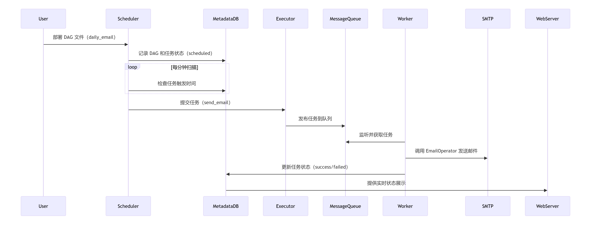

# Airflow
Airflow 是一个工作流平台。

链接：
- [官网](https://airflow.apache.org/docs/apache-airflow/stable/index.html)
- [github](https://github.com/apache/airflow)
- [中文文档](https://airflow-doc-zh.readthedocs.io/zh-cn/latest/5/)


一个简单的例子：
```python
from datetime import datetime

from airflow.sdk import DAG, task
from airflow.providers.standard.operators.bash import BashOperator

# A DAG represents a workflow, a collection of tasks
with DAG(dag_id="demo", start_date=datetime(2022, 1, 1), schedule="0 0 * * *") as dag:
    # Tasks are represented as operators
    hello = BashOperator(task_id="hello", bash_command="echo hello")

    @task()
    def airflow():
        print("airflow")

    # Set dependencies between tasks
    hello >> airflow()
```

## Airflow 相关概念

基础概念
- **DAG**
    - 工作流的形式
- **Operator**
    - BashOperator / PythonOperator / HTTPOperator / KafkaOperator
- **Task​**
    - DAG 中的一个节点，对应一个 Operator 实例

核心组件
- **Web Server**
    - 提供图形化界面（UI），用于监控和管理工作流（DAG）
        - 可视化DAG依赖关系、任务状态、日志等。
        - 手动触发或暂停DAG运行。
        - 查看任务执行历史、重试失败任务等。
- **Scheduler**
    - 调度器，调度系统的核心，负责解析DAG、管理任务依赖和触发任务执行
        - 定期扫描 `DAG_DIR` 目录，解析 DAG 文件，并且更新元数据库；
        - 根据调度时间、依赖关系和任务状态生成任务实例（Task Instance）
        - 将可执行的任务提交给​​Executor​​
- **Executor**
    - 负责执行任务，如 LocalExecutor / CeleryExecutor / KubernetesExecutor
        - SequentialExecutor​​：单进程顺序执行（仅测试用）。
        - ​​LocalExecutor​​：本地多进程并行执行。
        - CeleryExecutor​​：分布式执行，依赖消息队列（如Redis/RabbitMQ）和Worker集群。
        - ​​KubernetesExecutor​​：动态创建Kubernetes Pod执行任务，适合弹性伸缩环境。
- **Worker**
    - 实际执行任务的节点
        - ​​Celery Worker​​：配合CeleryExecutor，从消息队列获取任务并执行。
        - ​​Kubernetes Pod​​：配合KubernetesExecutor，每个任务在独立Pod中运行
- **Message Queue**
    - 消息队列，在 executor 和 worker 之间传递消息，executor 是生产者，worker是消费者
- **Metadata Database**
    - 存储Airflow的元数据，包括DAG结构、任务实例状态、变量（Variables）、连接（Connections）等
    - PostgreSQL、MySQL（生产环境推荐）；默认SQLite仅用于测试


下面是一个每天早上发送邮件的任务在 airflow 中实际运行的示意图




## Metadata Database 元数据库
有哪些表？


## 安装

方法一：pip
```bash
https://raw.githubusercontent.com/apache/airflow/constraints-3.0.0/constraints-3.9.txt
```