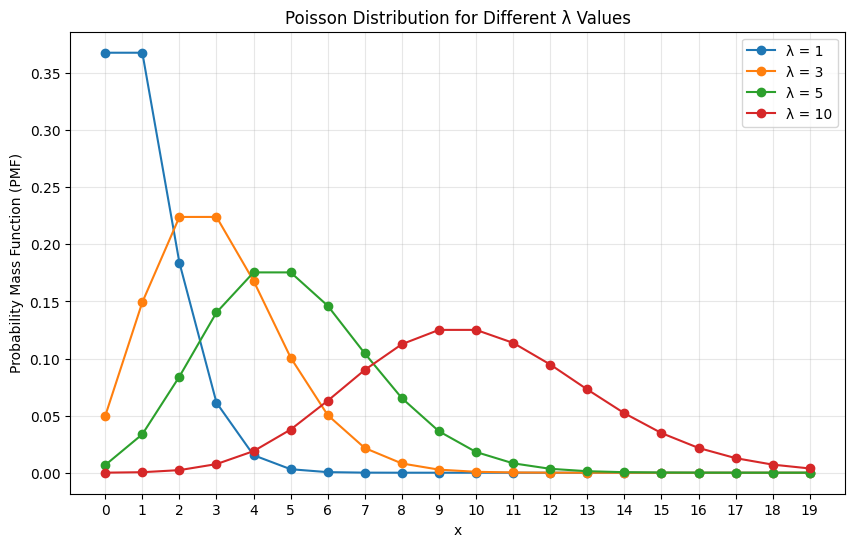
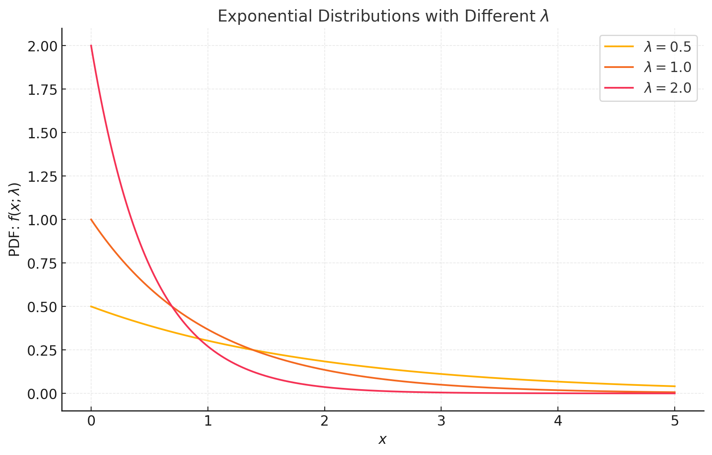
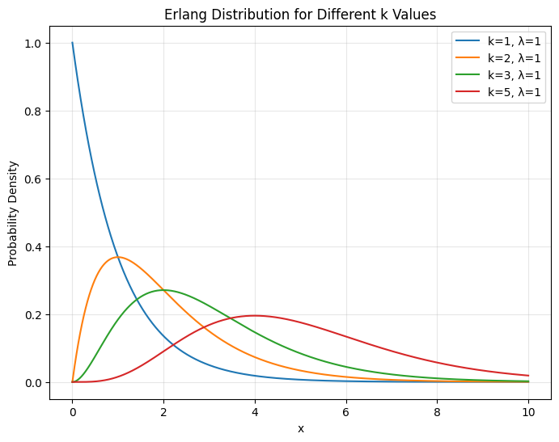

# 排队论

## 1. 概述
排队论（Queueing Theory）是研究排队现象的数学理论，主要分析顾客（或任务）等待服务的行为，并且通过建立数学模型来描述、预测和优化这些等待过程。

排队论是应用数学中运筹学的一个重要分支，特别是在资源调度和决策分析方面。运筹学中的许多方法，如线性规划、整数规划和动态规划等，都可以与排队论结合，解决更复杂的排队和调度问题。

排队论广泛应用于各个领域，如通信、计算机网络、交通运输、银行、呼叫中心、制造业等，涉及到资源调度、流量管理和效率优化等方面。

丹麦工程师艾伦·卡恩（A.K. Erlang）是排队论的奠基人之一，他提出了第一个排队模型。Erlang 分析了电话交换系统中的排队问题，提出了 Erlang 公式来计算电话呼叫的阻塞概率。

M/M/1模型：这一模型假设顾客到达服从泊松过程，服务时间服从指数分布，且系统只有一个服务台。这个模型是排队论的基石，并成为分析许多排队系统的标准模型。

## 2. 最基础的排队模型

### 排队问题描述
基本概念
- 顾客（Customers）：通常代表需要服务的对象，可以是数据包、呼叫、病人、客户等。
- 服务台（Servers）：提供服务的设施或人员，例如计算机处理器、银行柜员、医院医生等。
- 队列（Queue）：等待服务的顾客组成的队列。
- 服务过程（Service Process）：顾客接受服务的过程，通常是随机的，服务时间可能服从某种概率分布。
- 到达过程（Arrival Process）：顾客到达系统的过程，通常也服从某种概率分布。

### 排队规则
排队系统可以通过以下几个关键要素来定义：
- 顾客到达的分布：顾客到达的间隔时间一般使用泊松过程建模，或者到达时间服从指数分布。在这种情况下，顾客到达的次数服从泊松分布。
- 服务时间的分布：服务时间通常是随机的，可以用指数分布、正态分布或其他分布来建模。指数分布的服务时间表示每个顾客的服务时间相互独立，且服从相同的分布。
- 排队规则：排队系统的排队规则也有多种，常见的包括：
    - FCFS（First-Come-First-Served）：先到先服务，最常见的排队窗口。
    - LCFS（Last-Come-First-Served）：后到先服务，如堆放木材的取用。
    - SJF（Shortest Job First）：先服务预计服务时间最短的顾客，。
    - Priority Queue：根据优先级来决定服务顺序，如 VIP 窗口。
    - RSS，随机服务，如热线电话
- 系统容量：指系统最多能容纳多少个顾客，若队列已满，新到达的顾客可能会被丢弃或直接离开。
- 排队的数量和服务的数量：排队论中的系统可以是单服务器或多服务器系统。
    - 例如，单服务器系统（M/M/1）表示有一个服务台，且顾客到达和服务时间都服从指数分布。

### 性能指标

过分析排队模型，常常关注以下几个性能指标（随机变量的数字特征）：
- 系统中的平均顾客数（$Ls$）：系统中（包括正在接受服务的顾客和排队等待的顾客）的平均数量。
- 队列中的平均顾客数 $Lq$：仅排队等待服务的顾客数量的平均值。
- 系统的平均等待时间 $Ws$：顾客在系统中（包括服务时间和等待时间）的平均时间。
- 队列的平均等待时间 $Wq$：顾客在队列中等待服务的平均时间。
- 系统的利用率 $\rho$：服务器的使用比例，即 $\rho = \frac{\lambda}{\mu}$。
    - 平均到达率 $\lambda$，单位时间内平均到达的顾客数
    - 平均服务率 $\mu$，，单位时间内平均服务的顾客数

### 排队模型的记号-Kendall符号
在排队论中，Kendall符号（或Kendall记号）是一种标准化的表示排队系统的方式

英国数学家David G. Kendall在1950年代提出，Kendall符号用于描述排队模型的关键特性，包括到达过程、服务过程和系统的结构。

Kendall符号的标准形式是 `A/B/c`，其中：
- A（到达过程）：描述顾客到达系统的过程。通常使用概率分布来表示。例如：
    - M：表示顾客到达过程服从**泊松过程**，即到达间隔时间服从**指数分布（Markovian）**。
    - D：表示顾客到达过程是确定性的，即到达时间是固定的（Deterministic）。
    - G：表示顾客到达过程服从**一般的概率分布（General）**。
    - B：表示顾客到达过程有一定的周期性，可能涉及一些周期性的模式（Burst）。
- B（服务过程）：描述服务过程的特性，通常也是通过概率分布来表示。例如：
    - M：表示服务时间服从**指数分布（Markovian）**。
    - D：表示服务时间是确定性的，即每个顾客的服务时间是固定的（Deterministic）。
    - G：表示服务时间服从**一般的概率分布（General）**。
- c（服务台数量）：表示系统中服务台的数量。常见的有：
    - 1：一个服务台（单服务器）。
    - c：多个服务台。

因此，Kendall 符号 A/B/c 可以描述为：
- A：顾客到达的随机过程；
- B：顾客接受服务的时间分布；
- c：服务台的数量。

常见的排队模型表示
- `M/M/1`：表示一个单服务器的排队系统，其中顾客到达服从泊松过程（M），服务时间服从指数分布（M），并且只有一个服务台（1）。
- `M/M/c`：表示有c个服务台的排队系统，顾客到达服从泊松过程（M），服务时间服从指数分布（M）。
- `M/G/1`：表示单服务器的排队系统，其中顾客到达服从泊松过程（M），服务时间服从一般的概率分布（G）。
- `G/G/1`：表示单服务器的排队系统，顾客到达和服务时间都服从一般的概率分布（G）。

## 3. 排队论中的分布

### 泊松分布
泊松分布（Poisson distribution）是一种**离散型概率分布**，描述在固定时间段或空间区域内，某随机事件发生的次数。如果事件在不同时间段或空间区域内独立发生，且其平均发生次数 $\lambda$ 是已知的，则这些事件发生的次数可以用泊松分布建模。

泊松分布以法国数学家西莫恩·泊松（Siméon Denis Poisson）命名，常用于描述稀疏事件或随机事件的计数过程。

如果一个随机变量 $X$ 表示在单位时间或单位空间内某事件发生的次数，且 $X$ 满足以下条件：
- 独立性：事件在不同时间段或区域内的发生是互相独立的。
- 稀疏性：单位时间或单位空间内事件发生的概率较小。
- 平均性：在固定时间段或空间区域内，事件的平均发生次数是恒定的，记为 

则 $X$ 服从泊松分布，记为: $X \sim \text{Poisson}(\lambda)$

泊松分布的概率质量函数（PMF）为：

$$P(X = k) = \frac{\lambda^k e^{-\lambda}}{k!}, \quad k = 0, 1, 2, \dots$$

其中 $\lambda > 0$ 表示单位时间或单位空间内事件发生的平均次数（泊松分布的参数）。

泊松分布适用于描述稀疏或随机事件，如电话呼叫的次数、顾客到达的数量、设备故障的频率等。

参考下面的泊松分布概率质量函数直方图：

泊松分布的性质：

- 泊松分布的均值和方差都等于参数 $\lambda$，即: $$\mathbb{E}(X) = \lambda, \quad \text{Var}(X) = \lambda$$ 可以通过数学期望和方差的定义来推导和证明。
- 稀疏性： 当 $\lambda$ 较小时，泊松分布的形状呈现高峰在 0 附近，表示大多数情况下事件发生次数较少。
- 对称性： 泊松分布是右偏分布，但当 $\lambda$ 较大时，其形状趋近于对称，并逐渐逼近正态分布（中心极限定理）。

### 指数分布
指数分布（Exponential Distribution）是一种常见的**连续概率分布**，广泛用于描述事件发生的**时间间隔**或**等待时间**。其特点是事件发生的概率与时间的长度无关，通常用于建模随机事件的间隔时间。

指数分布是由参数 $\lambda>0$（称为率参数或强度参数）定义的分布，其概率密度函数（PDF）为：

$$
f(x; \lambda) =
\begin{cases} 
\lambda e^{-\lambda x}, & x \geq 0, \\
0, & x < 0.
\end{cases}
$$

其中：
- $x$ 是随机变量，表示时间间隔。
- $\lambda>0$ 是正实数，表示事件发生的平均速率。

因为指数分布的指数项是负的，所以指数分布有时候也叫作**负指数分布**，只是用来强调负的指数项。

参考下面指数分布的概率密度函数图：

从图上可以看出下面的性质：
1. 概率密度随着 $x$ 的增大单调递减
2. 图像的形状由参数 $\lambda$ 决定， $\lambda$ 越大，分布越集中在 $0$ 附近。

指数分布的期望值和方差分别是: $$\mathbb{E}[X] = \frac1\lambda, \quad \text{Var}[X]= \frac1{\lambda^2}$$

举个例子，假如某个设备平均50小时就会坏一次，那么单位小时内发生故障的次数为 $\lambda = \frac1{50}$，对应指数分布为 $f(x) = \frac1{50}e^{-\frac1{50}x}$，设备在三天（72小时）内会坏的概率为 $P(X<72) = \int_0^{72}\lambda e^{-\lambda x} =\left. 1 - e^{-\lambda x}  \right |_0^{72} = 1 - e^{-\lambda * 72} = 0.763$

### Erlang分布
Erlang 分布是 Gamma 分布的一种特殊形式，其概率密度函数为：

$$ f(x; k, \lambda) = \frac{\lambda^k x^{k-1} e^{-\lambda x}}{(k-1)!}, \quad x \geq 0 $$

其中：
- $k$ 是形状参数（必须为正整数）。当 $k=1$ 时，就是指数分布。这个参数对应服务需要 $k$ 个阶段。
- $\lambda$ 是速率参数，表示事件发生的速率（即每单位时间的事件数）。
- 随机变量 $x$ 是观察到的时间或间隔。

参考下面指数分布的概率密度函数图：

Erlang 分布常用于 M/M/c 模型。

## 4. Little's Law（列特法则）

Little's Law（列特法则） 是排队论中的一个基本定理，它描述了一个稳态排队系统中的三个主要参数之间的关系：系统中的平均客户数量（或物品数量）、平均客户等待时间和到达率。

Little's Law 适用于任何**稳态**排队系统，且无论排队方式或服务方式如何，都能成立。这个定理为我们提供了在已知部分信息的情况下推算系统表现的有力工具。

$$L = \lambda W$$

其中：
- $L$: 系统中的平均客户数量（或物品数量），即队列中以及正在接受服务的客户/物品的总数。
- $\lambda$: 到达率（Arrival Rate），即单位时间内进入系统的客户或物品的平均数量。通常用单位为 "客户/时间"（例如每分钟接入的电话数量）。
- $W$: 客户在系统中的平均时间（System Time），即客户从到达系统到离开系统的总时间。包括在排队中的时间和在接受服务时的时间。

该公式由 `J.D.C. Little` 在 1960 年的论文 [A Proof for the Queuing Formula L = λW](https://fisherp.scripts.mit.edu/wordpress/wp-content/uploads/2015/11/ContentServer.pdf) 中给出形式化的证明。

## 5. M/M/1 和 M/M/c 模型

## 6. 应用
排队论的应用
- 通信网络：分析数据包在网络中排队等待传输的情况，以及如何优化带宽和延迟。
- 客户服务：例如，银行、医院、呼叫中心等，帮助优化服务台的数量，减少顾客的等待时间。
- 制造业：在生产过程中，通过排队论分析设备的使用率和生产效率，优化生产调度。
- 计算机系统：在计算机系统中，排队理论可以用于分析进程调度、CPU调度等。

例1: 某眈误医院的一个科室有一位医生值班，经过长期的观察，每小时平均有4个病人，医生每小时平均可以诊断5个病人，病人的到来服从泊松分布，诊断时间服从负指数分布。
- (1) 试分析该科室的工作状况
- (2) 如果要求99%以上的病人有座位坐，该科室至少应该设置多少座位
- (3) 如果该科室每天24小时上班，病人因看病一小时而耽误工作单位要损失30元，这样单位平均要损失多少元?
- (4) 如果该科室提高看病速度，每小时平均可以诊断6个人，单位每天可以减少多少损失?可以减少多少座位?

例2:
某店有一个修理工人，顾客到达满足泊松流，平均每小时3人，修理时间服从负指数分布，修理完成平均需要19分钟，求:
- (1) 店内的空闲时间
- (2) 有4个顾客的概率
- (3) 至少有一个顾客的概率
- (4) 店内顾客的平均数
- (5) 平均等待的修理时间
- (6) 一个顾客在店里逗留超过15分钟的概率

参考：
- [排队论及其应用浅析](https://lrita.github.io/images/posts/math/排队论及其应用浅析.pdf)
- [数学建模——排队论笔记](https://blog.csdn.net/weixin_45745854/article/details/107357667)
