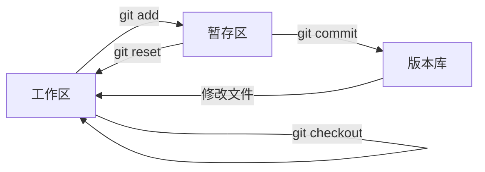

# Git

参考
- [廖雪峰的教程](https://www.liaoxuefeng.com/wiki/896043488029600)
- [learning it](https://learngitbranching.js.org/)

Git 是一个分布式的版本控制系统；

SVN 也是一个版本控制系统，但是是集中式的，有中央服务器的概念；

## 初始化与配置
初始化
```bash
# 创建一个新的仓库，会在当前的目录下创建 .git/ 文件夹；
git init

# 配置基本信息
git config --list 查看配置的信息
git config --user.email xiaobinzhang@pony.ai
git config --user.name xiaobinzhang

# 设置默认送的远程分支（直接git push就行
git config --global push.default current
```

## 代码管理
代码的状态分成：工作区、暂存区、版本库三种。

主要流程：


用 `git add` 提交代码
```bash
# 会把文件从工作区（working directory）提交到暂存区（staging area）；
git add readme.txt 
```

用 `git commit` 提交更改
```bash
# 提交更改，永久记录到版本历史中
git commit

# 合并上次的提交
git commit --amend
git commit --amend --no-edit
git commit --amend -m “new commit log"
```

用 `git reset` 命令可以撤销更改
```bash
git add text.txt
# 1. 从暂存区回退到工作区，和 git add 命令相反
git reset HEAD text.txt

git add text.txt
git commit
# 2. 回退上个版本到工作区，等于 add+commit 的反操作
# 当前版本是 HEAD，上个版本是 HEAD^，上上个版本是 HEAD^^或者 HEAD~2；
git reset HEAD^ text.txt

# 回退到 序号为 commit_id 的那个版本
git reset commit_id
```

`git reset` 有三种模型
- `--soft` 撤销提交，不会影响工作区和暂存区
- `--mixed(default)` 撤销提交和添加，回到工作区。
- `--hard` 撤销提交和修改，慎用，所有的修改都没了。

用 `git log` 查看修改历史
```bash
# 查看当前 commit 的修改历史
git log
# 美化版的日志
git log --graph --oneline --all

# 查看两个分支的区别
git log --graph --oneline branch1 branch2
# 更复杂的命令
git log --graph --pretty=format:'%Cred%h%Creset -%C(yellow)%d%Creset %s %Cgreen(%cr) %C(bold blue)<%an>%Creset' --abbrev-commit --date=relative --all

# 查看修改历史
git reflog
```

## 分支管理

分支习惯：
- master: 主分支，尽量稳定
- dev: 开发分支，用于开发新功能；
- release: 发布分值，发布稳定的版本
- bug: 用于本地来解决 bug；

 换 remote
    - git remote rm origin # 删除现在的远程地址
    - git remote add origin https://github.com/Halfish/test.git
- 远程仓库
    - git remote add origin git@github.com:michaelliao/learngit.git 添加远程仓库
    - git push -u origin master 推送到远程仓库中；
    - git clone git@github.com:michaelliao/gitskills.git 从远程仓库克隆一个版本
- 多人协作
    - git branch --set-upstream-to=origin/dev dev # 本地 dev 和远程的 dev 要建立连接；
    - git pull  # 从远程拉取代码；
    - git pull = git fetch + git merge FETCH_HEAD
    - git pull --rebase = git fetch + git rebase FETCH_HEAD
- rebase
    - git rebase；  # rebase操作可以把本地未push的分叉提交历史整理成直线；
    - git rebase 可能会因为冲突而中断
    - git rebase --continue 解决冲突以后，继续操作
- 标签
- git tag v1.0
    - git tag v0.9 f52c633 # 针对某个 commit_id 来打标签； 
    - git show v0.9 # 查看标签信息
    - git tag -a v0.1 -m "version 0.1 released” 1094adb # 创建带有说明的标签，用-a指定标签名，-m指定说明文字
- github or gitee
    - https://gitee.com/

## 配置

中文乱码问题
```bash
git config --global i18n.logOutputEncoding utf-8
git config --global core.quotepath off
```

## 分支 Branch

创建分支
```bash
# 查看分支
git branch -a

# 新建一个叫做 "spoon" 的分支
git branch spoon

# 切换到 spoon 分支
git checkout spoon

# 新建并且切换到 spoon 分支；
git checkout -b spoon

# 建议用 switch 命令替换 checkout；
git switch -c spoon
```

合并分支
```bash
# 合并 spoon 到当前的分支
git merge spoon

# 禁用 fast-forward 模式
git merge --no-ff -m "merge with no-ff” dev
```

删除分支
```bash
# 删除本地分支，不能在要删除的分支上操作，且分支必须得提交到远程
git branch -d <branch_name>

# 强制删除本地分支，不需要被推送或者合并
git branch -D <branch_name>

# 删除远程分支
git push origin --delete origin/fix_02

# 删除以后，同步列表（远程已删除的分支不会再显示，但是本地的还在）
git fetch -p(--prune)
```
## remote（远程分支）

```bash
# 查看 remote 信息
git remote -v(--verbose)

# 查看远程的详细信息
git remote show origin

# 查看分支以及和远程的关系
git branch -vv
```

## fetch （拉取远程分支）
```bash
# 拉取远程分支（下面两种写法等价）
git fetch
git fetch origin

# 从所有的远程仓库拉取（如 origin，upstream）
git fetch --all

# 拉取某个分支
git fetch origin main
```

## pull （等于 fetch + merge）
```bash
# 拉取远程分支，并合并到本地
git pull origin main
# 等价于
git fetch origin main
git merge origin/main

# 拉取远程分支，并 rebase 到本地
git pull --rebase origin main
# 等价于
git fetch origin main
git rebase origin/main
```

## merge （合并）
```bash
# 将远程的开发分支合并到本地的main分支
git checkout main
git merge origin/feature
```

## stash（储藏）
可以暂时把当前分支的修改存储起来。

```bash
# 假设当前已经有了一些修改，包括已经 git add 的文件。
# 存储当前状态
git stash

# 查看素有的stash
git stash list

# 应用和删除第一个stash
git stash pop

# 移除 stash
git stash drop stash@{0}
git stash clear

# 查看 diff
git stash show
```
## submodule
子模块
```bash
# 添加特定分支作为子模块
git submodule add -b <分支名> <仓库URL> <目标路径>

# 查看状态
git submodule status
```

## 其他问题

### 卡顿问题
有时候 git 仓库太大，oh-my-zsh 检测可能会卡住，执行
```bash
git config --add oh-my-zsh.hide-dirty 1    # 设置 oh-my-zsh 不读取文件变化信息
git config --add oh-my-zsh.hide-status 1   # 设置 oh-my-zsh 不读取任何 git 信息
```

### 中文乱码
如果出现中文乱码，可以关掉转义配置。
```bash
git config --global core.quotepath off
```

### 设置代理

如果 git 命令遇到了网络问题，可以配置 SSH 代理。

```bash
vim ~/.ssh/config
```

编辑配置
```
Host github.com
    HostName github.com
    User git
    ProxyCommand nc -X 5 -x <proxy_address>:<proxy_port> %h %p
```

- 将 `<proxy_address>` 替换为 SOCKS 代理地址（例如 127.0.0.1）。
- 将 `<proxy_port>` 替换为代理端口（例如 1080）。
